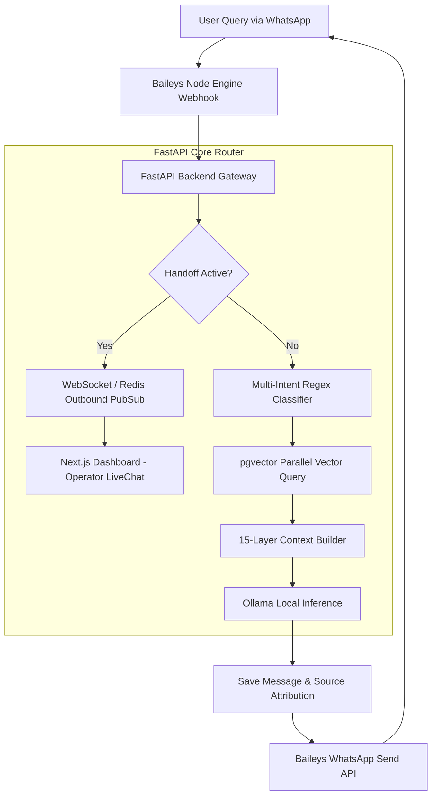

# ReplyOS — Enterprise Multi-Tenant AI WhatsApp SaaS Platform

[](#-system-architecture--data-flow-overview)
[](https://fastapi.tiangolo.com)
[](https://nextjs.org)
[](#-database-schema-specifications)
[](https://redis.io)
[](https://ollama.ai)

ReplyOS is a high-performance, containerized, multi-tenant WhatsApp automation SaaS platform. It is engineered with a unified intelligence engine, OCR-capable document ingestion, a state-machine-driven live-override control plane, and a robust, self-hosted relational/vector database.

---

## 🏗️ System Architecture & Data Flow Overview

ReplyOS merges isolated tenant parameters, real-time client conversation memories, dynamic vector database RAG resources, and manual operator chat hooks into a unified, high-reliability operational pipeline.



### 🚀 Core Subsystem Mechanisms

#### 1. Unified Intelligence Matrix
Consolidates business configurations, customer memories, and RAG knowledge chunks. An immutable priority-ordering compiler dynamically forms the prompt context to eliminate model hallucinations.

#### 2. Multi-Intent Query Decomposition
An NLP-based regex-splitting parser extracts multiple conjunction clauses (`aur`, `and`, `,`, `&`) from user inputs. It queries `pgvector` concurrently for each segment and fuses the top 5 unique results, preventing attention decay.

#### 3. Machine-Vision OCR Ingestion Stream
Integrates `Pillow` and `Tesseract OCR` directly into asynchronous Celery tasks to process binary payloads (`.png`, `.jpg`, `.jpeg`, `.webp`), converting printed catalogs into vector embeddings for `pgvector`.

#### 4. Live Override Control Plane
A real-time WebSocket state-machine (states: `AI_ACTIVE`, `WAITING_AGENT`, `HUMAN_ACTIVE`, `RESOLVED`) overrides LLM processes. Live operator messages route instantly through Redis Pub/Sub `whatsapp_outbound` to the Baileys engine.

---

## 📊 Low-Level Microservices Health Grid

The platform executes within isolated Docker containers matching SRE operational telemetry:

| Container Name | Internal Port | External Port | Primary System Responsibility |
| :--- | :--- | :--- | :--- |
| `saas_nginx` | `80` / `443` | `8080` | Reverse proxy, static asset handler, SSL termination, and API routing. |
| `saas_frontend` | `3000` | `30000` (internal mapping) | Next.js operator dashboard, configuration workspace, and chat panels. |
| `saas_backend` | `8000` | None | FastAPI kernel core, JWT security router, and WebSocket manager. |
| `saas_whatsapp_engine`| `3000` | None | Node.js companion running Baileys WhatsApp protocol client wrapper. |
| `saas_ollama` | `11434` | None | Local CPU-optimized model inference engine running Mistral-7B / Qwen-2.5. |
| `saas_worker` | `8000` (worker thread) | None | Celery background job worker for document parsing and OCR pipeline. |
| `saas_redis` | `6379` | None | In-memory message broker, task queue storage, and WebSocket pub/sub. |
| `saas_postgres` | `5432` | None | Relational schema storage, conversation memory, and pgvector embeddings. |

---

## 🔒 Security & Native Authentication Boundary

ReplyOS operates an independent, stateless, self-hosted security gateway. It contains no external authentication dependencies (e.g., Auth0, Firebase, Google SSO).

- **Cryptography Protocol:** User passwords are encrypted utilizing **bcrypt** with a work factor of **12** (managed via Python's `passlib` library).
- **Token Signature Model:** Sessions use standard **JSON Web Tokens (JWT)** signed via **HMAC-SHA256** using a cryptographically secure host-level key (`JWT_SECRET`).
- **Session Lifetimes:**
  - Owner / Member Client Tokens: **24 Hours** (Scope: `tenant`).
  - Super Admin Tokens: **2 Hours** (Scope: `super_admin`, requires TOTP).
- **CORS & Proxy Safeguards:** Nginx enforces `SAMEORIGIN` frames, blocks MIME sniffing, and limits cross-origin access strictly to registered white-listed deployment subdomains.

---

## 📊 Database Schema Specifications

```
 [tenants] 1 ──── 0..* [users]
    │ 1
    ├──────────── 0..* [whatsapp_sessions] 1 ── 0..* [conversations] 1 ── 0..* [messages]
    │ 1                                                                       │ 1..*
    ├──────────── 0..* [chatbots] ────────────────────────────────────────────┘
    │ 1
    ├──────────── 1 [subscriptions]
    │ 1
    └──────────── 0..* [audit_logs]
```

### Table Mappings

1. **`tenants`**: Manages customer accounts.
   - Columns: `id` (UUID, PK), `name` (VARCHAR), `subdomain` (VARCHAR, UNIQUE), `status` (VARCHAR: `active`, `suspended`, `terminated`), `data_retention_policy` (VARCHAR), `termination_grace_period_ends` (TIMESTAMP), `is_visible` (BOOLEAN).
2. **`users`**: User details.
   - Columns: `id` (UUID, PK), `tenant_id` (UUID, FK), `email` (VARCHAR, UNIQUE), `password_hash` (VARCHAR), `role` (VARCHAR: `admin`, `owner`, `member`), `is_active` (BOOLEAN).
3. **`conversations`**: Active user sessions.
   - Columns: `id` (UUID, PK), `tenant_id` (UUID, FK), `customer_phone` (VARCHAR), `customer_name` (VARCHAR), `customer_preferences` (TEXT), `past_interactions_summary` (TEXT), `open_tickets` (TEXT), `lead_status` (VARCHAR), `handoff_status` (VARCHAR), `bot_override` (BOOLEAN).
4. **`messages`**: Message history and analytics metadata.
   - Columns: `id` (UUID, PK), `conversation_id` (UUID, FK), `whatsapp_message_id` (VARCHAR, UNIQUE), `sender` (VARCHAR), `text` (TEXT), `origin` (VARCHAR: `inbound`, `outbound`), `ack_state` (VARCHAR), `source_metadata` (JSONB - stores source attribution tracking metrics).
5. **`kb_documents` / `kb_document_chunks`**: Document files and pgvector vectors.
   - Columns: `id` (UUID, PK), `kb_id` (UUID), `title` (VARCHAR), `content` (TEXT), `embedding` (VECTOR(384) - mapped via Ollama embedding models), `error_message` (TEXT - stores failure OCR exceptions).

### Performance Optimization Indexes
- `idx_conversations_tenant_last_msg`: `conversations(tenant_id, last_message_at DESC)` (optimizes dashboard loading).
- `idx_messages_conv_created`: `messages(conversation_id, created_at ASC)` (speeds history retrieval).
- `idx_audit_logs_created`: `audit_logs(created_at DESC)` (speeds administrative log reviews).

---

## 🎯 The Verified 15-Layer AI Prompt Matrix

ReplyOS compiles system context using a 15-layer prompt matrix. It uses a strict priority resolver to guarantee correct answers, adhering to a predefined precedence list:

```
[Highest Priority]  1. Business Profile Details (Location, Contact, Working Hours)
                    2. AI Brain Config custom prompts / policies
                    3. Customer Memory details
                    4. RAG catalog retrieved vector chunks
                    5. Conversation History
[Lowest Priority]   6. General LLM Knowledge (Use only as a last resort)
```

### Prompt Compilation Structure

| Layer | Context Block | System Goal |
| :--- | :--- | :--- |
| **Layer 1** | System Core Directives | Direct identity constraints, multi-intent rules, and greeting suppression. |
| **Layer 2** | Personality & Tone | Applies professional, friendly, or specialized legal/medical behavior models. |
| **Layer 3** | Brand Identity | Binds the company name and brand voice to prevent generic AI declarations. |
| **Layer 4** | Services Directory | Describes service catalogs and availability details. |
| **Layer 5** | RAG Catalog Matrix | Injects retrieved catalog vector chunks directly (overriding generic options). |
| **Layer 6** | Commercial Rules & Policies | Encapsulates pricing lists, SLAs, and refund policies. |
| **Layer 7** | Reachability Details | Physical addresses, map directions, and links. |
| **Layer 8** | Operational Hours | Sets the active timing rules for business interactions. |
| **Layer 9** | Verified Retrieved FAQ | General Q&A vectors matching non-catalog inquiries. |
| **Layer 10**| Custom Instructions | Hardcoded developer overrides or client instructions. |
| **Layer 11**| Customer Profile | Pulls user name and preferences from persistent memory. |
| **Layer 12**| Relationship History | Summarizes past interactions. |
| **Layer 13**| Active Tickets | Displays open cases, preventing repetitive status questions. |
| **Layer 14**| Lead Funnel Stage | Captures customer stage (cold, warm, hot, converted) for sales agents. |
| **Layer 15**| Security & Guardrails | Prevents jailbreaking, competitor discussions, and code leaks. |

---

## 🛠️ Production Deployment Framework

Execute this sequence to build, compile, and run the system microservices container grid with zero cache footprint:

```bash
# Enter project root directory
cd ~/whatsapp-ai-saas/

# Bring down running instances and purge volumes
docker compose down --volumes --remove-orphans

# Build containers bypassing cache to ensure clean builds
docker compose build --no-cache

# Run container stack in detached mode
docker compose up -d

# Verify system container health
docker compose ps
```

Maintained under SRE Compliance Ledger Frameworks — Action 276 Locked Successfully.
