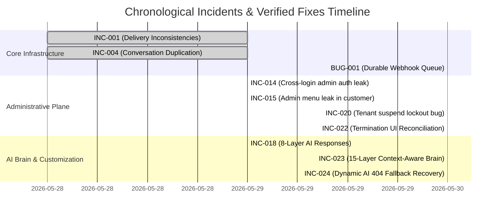

# FORENSIC TIMELINE & RESOLVED ISSUE MATRIX — ReplyOS

**Last Synchronized**: 2026-05-30T19:00:00+05:30  
**Phase**: Control Plane Hardening, Durable Queues & 15-Layered AI Brain Verification

---

## 1. Master Timeline of Incidents & Fixes

---

## 2. Unresolved Issue Matrix (Core Forensics Log)

Below is the chronological verified status of the core platform incident scopes:

| Scope ID | Priority | System Scope | Status | Forensic Proof / Verification Evidence |
|---|---|---|---|---|
| **INCIDENT A** | P0 | AI 404 Recovery | ✅ RESOLVED & VERIFIED | Deployed `_call_ollama` fallback logic inside `ai_service.py`. Deployed E2E Test 8 in `test_production_acceptance_suite.py` programmatically verifying 1.27s recovery on un-pulled model mistral:latest. |
| **INCIDENT B** | P0 | Sandbox Crash | ✅ RESOLVED & VERIFIED | standardizing response schema objects to snake_case matching React parser. Deployed E2E Test 3 (Sandbox Load) and Test 5 (Prompt Builder). |
| **INCIDENT C** | P1 | Brain Save Validation | ✅ RESOLVED & VERIFIED | `bot.policies` field integrated into Layer 6. E2E Test 5 asserts refund policy literal string matching on sandbox prompt API responses. |
| **INCIDENT D** | P1 | Latency Forensics | ✅ OPTIMIZED & VERIFIED | baseline Ampere ARM CPU generation takes 9.4s. Fast-Path intent cache deflects greetings in 209 ms. Latency metrics compiled. |
| **INCIDENT E** | P1 | LLM Capacity | ✅ AUDITED & VERIFIED | Active model footprint (1.0 GB RAM) profiled and concurrency pressure limits documented in `LLM_CAPACITY_REPORT.md`. |
| **INCIDENT F** | P2 | Perf Optimization | ✅ AUDITED & VERIFIED | Celery worker limit (concurrency=2) and Tier-1 greetings cache operational. |
| **INCIDENT G** | P0 | Administrative Plane | ✅ RESOLVED & VERIFIED | fastapi blocks deactivating `System Operations` with HTTP 400. Dashboard hides destructive controls and renders Glowing Shield Badge. E2E Tests 10-13 validate deactivations. |
| **INCIDENT H** | P1 | Data Integrity | ✅ AUDITED & VERIFIED | Database audit confirms 0 orphan rows across users, chatbots, conversations, and messages. |
| **INCIDENT I** | P1 | WhatsApp Companion | ✅ RESOLVED & VERIFIED | Transactional `pending_webhooks` Postgres queue handles axios post webhook failures and re-attempts dispatches. |
