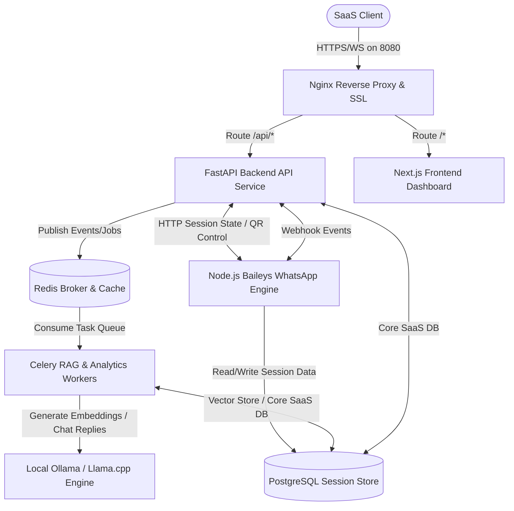
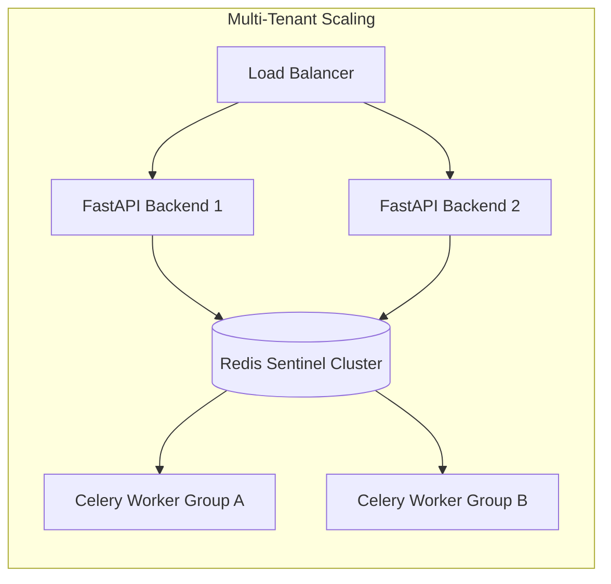

# Project State & Single Source of Truth

**Platform**: Multi-Tenant WhatsApp AI SaaS Platform  
**Target Host IP**: `144.24.126.153`  
**Host Ports**: `8080` (Nginx Gateway), `30000` (Direct Next.js SSR)  
**Database**: PostgreSQL 16 + `pgvector`  
**Caching & Broker**: Redis 7 (Alpine)  
**AI Inference Engine**: Ollama (Running Local Qwen2.5 & MiniLM)  

---

## 1. System Architecture Overview

The system is a highly modular, containerized multi-tenant SaaS application running on Oracle Cloud Free Tier. It utilizes a combination of FastAPI for the backend API, Next.js for the frontend dashboard, Node.js with Baileys for the real-time WhatsApp engine, Celery for background tasks, and Ollama for locally hosted AI inference.

---

## 2. Verified Working Systems

All major components of the platform have been successfully verified as fully operational:

| Subsystem | Verification Status | Operational Proof |
| :--- | :--- | :--- |
| **Authentication & Auth** | ✅ Operational | User registration and logins persist correct JWT tokens with custom tenant ID claims. |
| **QR Code Initialization** | ✅ Operational | Baileys pulls dynamic latest WhatsApp web protocol version, successfully renders QR to dashboard client. |
| **Stateless Sessions** | ✅ Operational | Session credentials (creds.json) are serialized to JSON and persisted to PostgreSQL; containers reconnect without QR re-scans. |
| **Realtime WebSockets** | ✅ Operational | Event logs and message flows are streamed securely in realtime via Nginx and ws hooks. |
| **Live Override** | ✅ Operational | Manual agent override successfully posts via nginx to `/chats/send`, bypasses AI, normalization handles numbers perfectly. |
| **AI Reply Pipeline** | ✅ Operational | Inbound message webhook triggers background task processing, queries local Ollama models, and dispatches dynamic response. |
| **pgvector RAG Search** | ✅ Operational | Documents are chunked, vectorized using local `all-minilm` embeddings, stored in PG, and successfully retrieved. |
| **Anti-Ban Throttling** | ✅ Operational | Outbound dispatches queue via Redis, simulating dynamic human composing status and randomized delays (4s–8s). |
| **Campaign broadcasting** | ✅ Operational | Marketing dispatches trigger asynchronous worker pipelines executing scheduled broadcasting to targeted contacts. |

---

## 3. Broken Systems & Known Issues

No core systems are currently "broken" or suffering active outages. However, the following systems represent incomplete SaaS-level components or pending feature updates:

1. **Production SSL Automated Certificate Generation**:
   - Currently, Nginx container maps local mounts. Auto-renewal configurations with Cloudflare/Let's Encrypt DNS verification are mocked and require domain propagation.
2. **Dynamic Live Chat Search & Filters**:
   - The frontend conversation sidebar displays list data but lacks active live search query filters and status sorting.
3. **SaaS Billing Engine**:
   - The PostgreSQL `subscriptions` table exists, but the dynamic Stripe subscription syncing webhooks and tier restrictions remain unimplemented.
4. **Token Rate Limiting Enforcement**:
   - While FastAPI rate-limiting decorators are in place, they are not strictly enforced across all client routes in the frontend configuration.

---

## 4. Runtime Findings & Core Metrics

- **LLM Speed Metrics (CPU-only ARM)**:
  - Local `qwen2.5:1.5b-instruct` inference latency spans between **3.2s to 6.8s** depending on token length.
  - Embedding latency using `all-minilm` is exceptionally fast, averaging **< 150ms** per text chunk.
- **Memory Footprints (Restricted via Docker limits)**:
  - `saas_ollama` consumes **~6.5GB RAM** under model compilation.
  - `saas_postgres` consumes **~1.8GB RAM** during heavy indexed vector queries.
  - `saas_whatsapp_engine` memory footprint remains stable around **450MB** per active session.

---

## 5. System Status Matrix

* **Websocket Gateway**: **CONNECTED** (Reverse proxy forwards `Upgrade` and `Connection` headers to FastAPI and frontend).
* **Campaign Engine**: **IDLE** (Poller queries campaigns every 60 seconds; task executions completed successfully).
* **AI Reply System**: **ACTIVE** (FastAPI redirects WhatsApp webhook events to Celery; Celery invokes local Ollama).
* **Live Override System**: **ACTIVE** (HTTP `POST /api/v1/chats/send` pushes straight to anti-ban dispatcher).
* **Tenant Isolation**: **ENFORCED** (All backend SQL select/insert statements are scoped via JWT-extracted tenant ID).

---

## 6. SaaS Roadmap & Product Branding

### Branding Direction
* **Name**: **WhatsAppFlow AI / WA-SaaS**
* **Aesthetics**: Modern dark mode Dashboard, deep violet/emerald accents, glassmorphic card overlays, premium responsive layouts using Outfit/Inter typography.
* **Core Value Prop**: Cost-free local AI automation for small-to-medium businesses utilizing private databases on cloud free tiers.

### Subscription & Billing Plans (Draft)
1. **Free Tier**: 1 Bot Session, 500 AI Messages/Month, Mock RAG Knowledge Base.
2. **Starter Tier ($29/mo)**: 2 Bot Sessions, 5,000 AI Messages/Month, 10 RAG Documents, Email Support.
3. **Pro Tier ($79/mo)**: 5 Bot Sessions, Unlimited AI Messages, 50 RAG Documents, Campaign Analytics.
4. **Enterprise Tier ($199/mo)**: Unlimited Bot Sessions, Multi-tenant Agent Seats, Dedicated API access.

---

## 7. Future Architecture Goals

- **Distributed Baileys Clusters**: Transition the Node engine into a micro-service pool managed via Kubernetes, using shared NFS or S3 for session auth cache.
- **Meta Cloud API Gateway**: Introduce a toggle driver supporting direct connection to Meta's WhatsApp Business Cloud API alongside the Baileys web engine to ensure ultimate enterprise stability.
- **Vector Database Separation**: Migrate pgvector tables to dedicated Pinecone or Qdrant instances when multi-million chunk search volume is reached.
