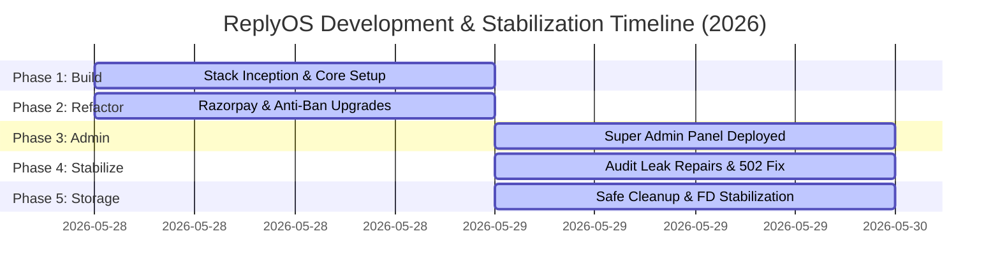

# ReplyOS — Project Timeline

This document tracks the chronological lifecycle of the ReplyOS Multi-Tenant WhatsApp AI SaaS platform, mapping milestones, sprints, and stabilization passes.

---

## 1. Project Lifecycles

---

## 2. Chronological Milestones

### 2026-05-28 — Platform Inception & Core Foundations
* **Stack Initialization**: Deployed the standard 8-service Docker Compose stack (Nginx, FastAPI Backend, Next.js Frontend, Baileys WhatsApp Engine, Celery Worker, Redis, Postgres, Ollama).
* **Multi-Tenant Schema**: Configured SQL structures mapping `tenants`, `users` (owners/members), `subscriptions`, `chatbots`, and `whatsapp_sessions`.
* **WhatsApp Session Store**: Implemented AES-256-GCM encrypted persistence layers in PostgreSQL for Baileys auth tokens.
* **Billing Setup**: Configured Razorpay SDK checkout integration and HMAC webhook processing.

### 2026-05-28 — Messaging Refactors & Stabilization
* **JID Canonicalization**: Built centralized `normalize_jid()` in the backend (`core/jid.py`) to prevent duplicate threads.
* **Anti-Ban Tuning**: Refactored `anti-ban.ts` to replace over-strict JID regex checks, adding throttled queues and typing simulation.
* **Razorpay Webhook Fixes**: Deployed webhook idempotency checks to prevent double-charging on Razorpay delivery retries.

### 2026-05-29 — Administrative Control Plane Sprint
* **Super Admin Portal**: Created the isolated administrative portal (`/admin`) and credentials router (`/admin/auth/login`).
* **Audit Logger**: Hooked SQL-backed `audit_logs` triggers to persist every admin mutation transactionally.
* **MFA TOTP**: Deployed pure-python, clock-drift tolerant 2FA setup and verify interfaces.
* **Termination Daemon**: Scheduled background Celery crons (`check_graceful_terminations_task`) to enforce 24h grace suspends.

### 2026-05-29 — Security & Telemetry Stabilization
* **Auth Leak Remediation**: Patched customer login boundaries to block admin credentials and gutted admin components from the customer dashboard page.
* **Telemetry Rebuild**: Replaced diagnostic telemetry mocks with live `psutil` system gauges and Celery inspects.
* **502 Incident Resolved**: Installed missing `psutil` dependency in requirements and restarted stack to resolve logging file-descriptor lockups.

### 2026-05-29 — Storage Audit & Safe Pruning (Phase 7)
* **Storage Dashboard**: Exposed `/admin/storage-report` querying raw Unix socket `system/df`.
* **Pruning Execution**: Reclaimed **10.02 GB** of VM host space by running build cache prunes, image prunes, and truncating container stderr/stdout logs.
