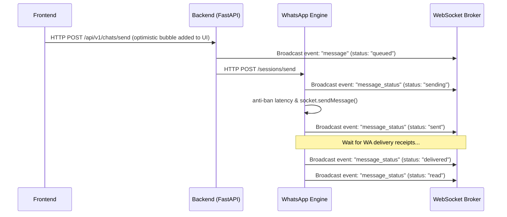

# Realtime WebSocket Sync Pipeline

## WebSocket Authorization
* **Route**: `/api/v1/ws?token=...`
* **Handshake**: Upgrades only after validating Bearer JWT. Checks expiration and sub references before adding the connection.
* **Tenant Scoping**: Once accepted, the connection is mapped inside a connection array grouped strictly by `tenant_id`.

## Outbound Delivery WebSocket Event Flow

When a message is sent or updated, it follows this event sequence:

## Message Event Reconciliation (Dedupe & ACK)
* **Outbound Overrides**: The agent triggers `sendMessage`, generating a local UUID and rendering the message as `sending` immediately.
* **Reconciliation Reducer**: When a WebSocket event of type `message` arrives with a matching `client_uuid` (or identical content and direction), the client replaces the optimistic state, updating the status to its latest state using a strict precedence helper:
  - Precedence: `failed (-1)` -> `sending (0)` -> `queued (1)` -> `sent (2)` -> `delivered (3)` -> `read (4)`.
  - Ensures statuses only advance and never downgrade (avoiding status flicker).
* **ACK updates**: When a `message_status` WebSocket update arrives, the client matches it by ID or UUID and updates the ACK state.

## Subscription Upgrade Real-time Sync
* **Limit Enforcement**: The backend queries `is_subscription_active` and `has_exceeded_message_limit` when checking outbound permissions.
* **Immediate Expiry Locks**: If a subscription is detected as expired, the backend publishes a `subscription_expired` WebSocket notification to the tenant channel, locking the console workspace immediately.
