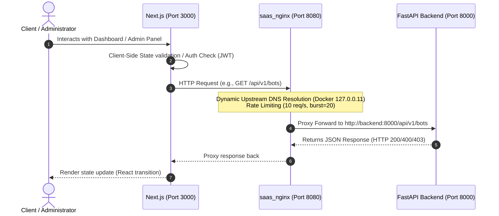
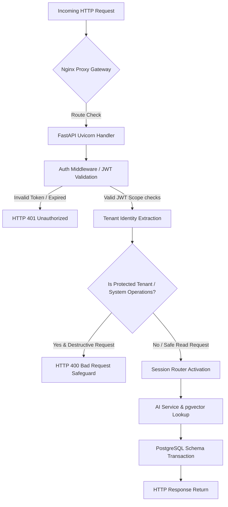
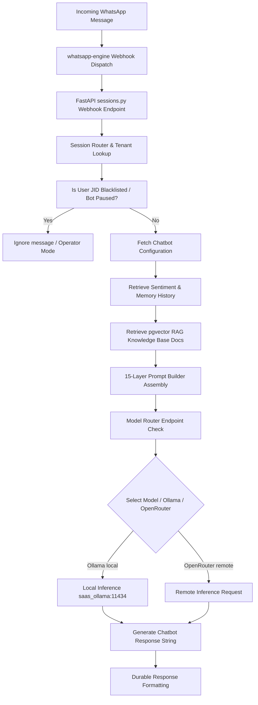
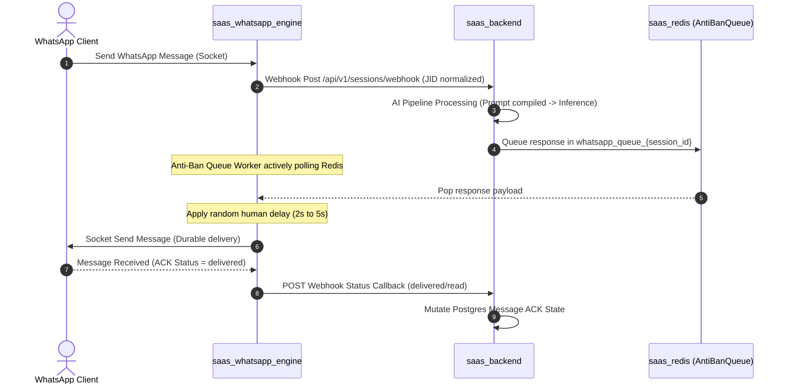

# SYSTEM RUNTIME FLOWS — ReplyOS

This document details the E2E runtime execution flows across the React/Next.js frontend, the FastAPI backend, the Baileys WhatsApp Node Engine, the PostgreSQL/pgvector database, the Redis message queue, and the Ollama AI inference engine.

---

## 1. Frontend Execution Flow (UI to API Gateway)

---

## 2. Backend Routing Flow (Request Processing Pipeline)

When FastAPI receives a request:

---

## 3. End-to-End AI Routing Flow (Webhook to LLM Response)

This flowchart illustrates the AI reasoning path starting from an incoming WhatsApp webhook:

---

## 4. WhatsApp Message Pipeline & Anti-Ban Flow

Tracks incoming data payloads, queuing dispatches via the Anti-Ban Redis list, and outbound delivery status updates:

