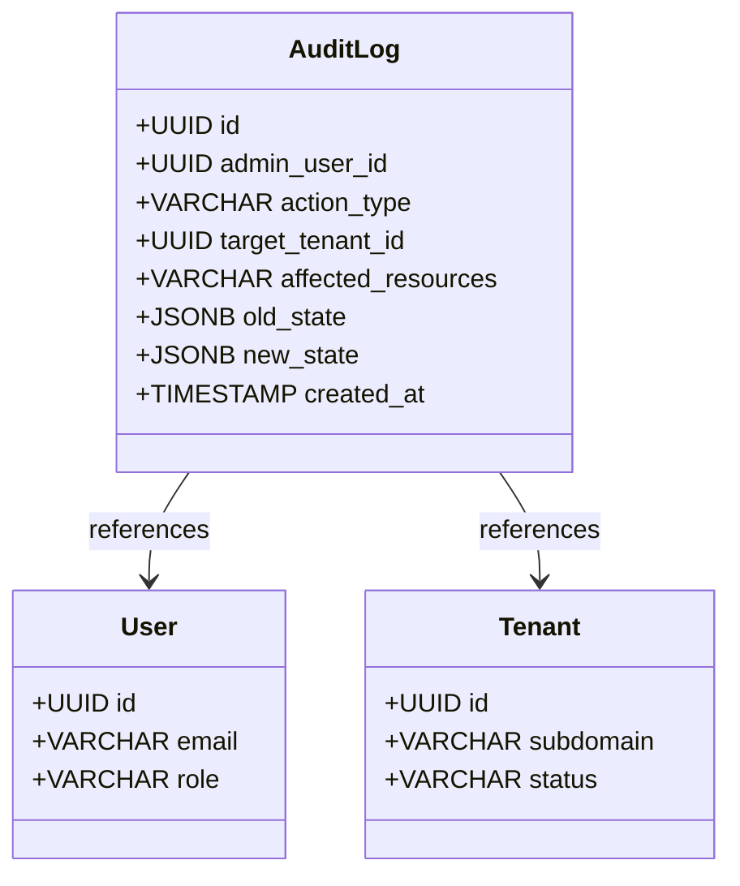

# Administrative Audit Logging Specification

This document details the system design, table structures, capture actions, and security compliance of the **ReplyOS Administrative Audit Logging System**.

---

## 1. Permanent Audit Log Architecture

ReplyOS enforces a strict database-level audit logging policy. Every administrative action registers an immutable record in the PostgreSQL database. These logs are reserved exclusively for regulatory compliance, security analytics, and platform tracing.



---

## 2. PostgreSQL Schema Mapping

Audit logs are permanently persisted in the `audit_logs` table:

```sql
CREATE TABLE audit_logs (
    id UUID PRIMARY KEY DEFAULT uuid_generate_v4(),
    admin_user_id UUID NOT NULL REFERENCES users(id) ON DELETE CASCADE,
    action_type VARCHAR(100) NOT NULL,
    target_tenant_id UUID REFERENCES tenants(id) ON DELETE CASCADE,
    affected_resources VARCHAR(255),
    old_state JSONB,
    new_state JSONB,
    created_at TIMESTAMP WITH TIME ZONE DEFAULT NOW()
);
```

* **`admin_user_id`**: Foreign Key linking to the User record of the administrator executing the action. (For system-level events or brute-force blocks, this field may be NULL).
* **`action_type`**: Core categorization tag representing the administrative event (e.g. `SUSPEND_TENANT`, `MANUAL_HARD_PURGE`).
* **`target_tenant_id`**: Foreign Key linking to the affected Tenant space. If a tenant is fully purged, database cascades automatically decouple the JID references while keeping the log details intact.
* **`old_state` & `new_state`**: JSONB columns capturing key-value snapshots representing modified properties (e.g. subscription tiers, active sessions count).

---

## 3. Logged Event Categories

Administrative logs automatically trace the following events:

### 3.1 Authentication & Security Actions
* **`SUCCESSFUL_ADMIN_LOGIN`**: Admin login completed successfully.
* **`FAILED_ADMIN_LOGIN`**: Unsuccessful login attempt (captured with email for lockout tracking).
* **`ACCOUNT_LOCKED`**: Brute-force rate limiter triggered, temporarily locking access.
* **`ADMIN_PASSWORD_ROTATE`**: Enforced credentials update completed.
* **`ADMIN_TOTP_ENABLED`**: Google Authenticator 2FA locked and enabled.
* **`ADMIN_RECOVERY_CODE_USED`**: Recovery token consumed during login.
* **`REVOKE_ADMIN_SESSION`**: Session manual logout blacklisting.

### 3.2 Tenant Lifecycle Actions
* **`SUSPEND_TENANT`**: Workspaces manual suspension.
* **`REACTIVATE_TENANT`**: Suspension manual lift.
* **`GRACEFUL_TERMINATION_SCHEDULED`**: Mode 2 Graceful 24-hour termination activated.
* **`INSTANT_TERMINATION`**: Mode 1 Immediate lockout and session revocation.
* **`INSTANT_TERMINATION_WITH_PURGE`**: Instant lockout with immediate hard delete.
* **`MANUAL_HARD_PURGE`**: Secure transactional purge committed.
* **`CHANGE_RETENTION_POLICY`**: Changed retention between `"archive"` and `"delete"`.
* **`FORCE_LOGOUT_TENANT_USERS`**: Terminating user tokens in a tenant.
* **`REVOKE_TENANT_WHATSAPP_SESSIONS`**: Disconnecting concurrent phone channels.

### 3.3 Subscription Overrides
* **`OVERRIDE_SUBSCRIPTION_PLAN`**: Custom billing period extensions or plan migrations.
* **`OVERRIDE_QUOTAS`**: Overwriting bot limits or message counts.
* **`RESET_USAGE_COUNTERS`**: Monthly message volume counters reset.

### 3.4 Platform Operations
* **`MANUAL_CRON_TRIGGER`**: Manual triggers of Celery background daemons.

---

## 4. Security & Log Immutability

To prevent tampering or record modification:
1. **No UPDATE/DELETE Endpoints**: The backend router does NOT expose any PUT, PATCH, or DELETE routes targeting the `audit_logs` table.
2. **Postgres Integrity**: Application database users are restricted from executing truncates or deletes on `audit_logs`.
3. **Traceability**: Every record captures the exact user, target tenant, resource altered, old state, and new state. Logs are accessible in the UI under **Permanent Administrative Audit**.
