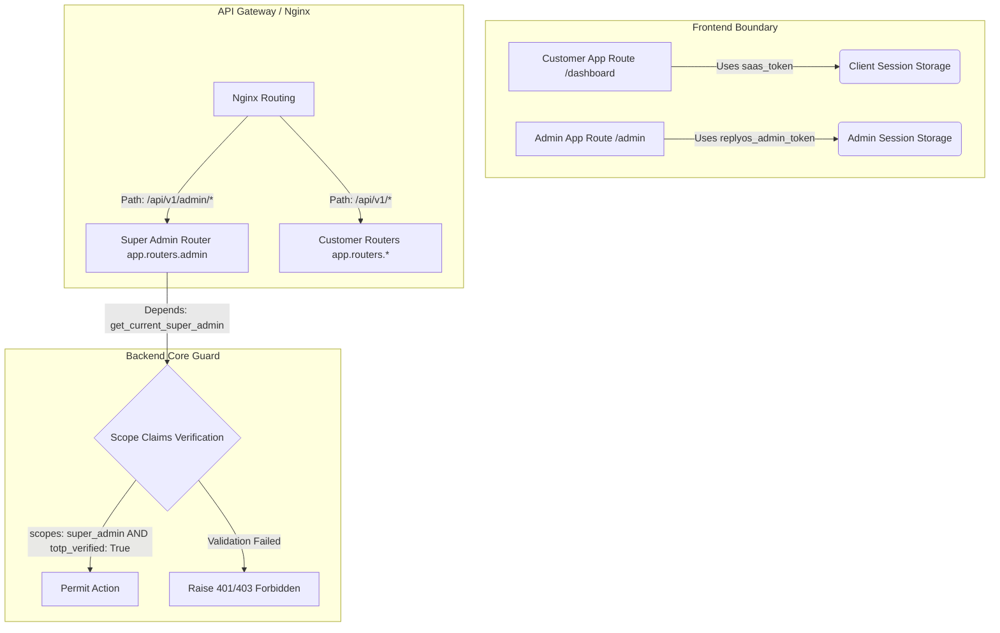

# Master Super Admin Architecture Blueprint

This document details the architectural specifications, access control isolation patterns, and database logging architectures designed for the **ReplyOS Master Super Admin Control Plane**.

---

## 1. Absolute Isolation Architecture

To prevent customer discovery, access, or route enumeration, the Control Plane is designed with a strict physical and logical boundary across the full SaaS stack:



### 1.1 Path-Aware Frontend Token Router
The `ApiClient` (`frontend/src/lib/api.ts`) implements a path-aware dynamic hook to automatically isolate credentials:
* **Token Retrieval**: If active window pathname starts with `/admin`, it extracts `replyos_admin_token` from local storage. Otherwise, it defaults to standard `saas_token`.
* **Session Lifecycle**: When setting session credentials or logging out, if pathname starts with `/admin`, it writes/deletes administrative keys (`replyos_admin_token`, `replyos_admin_tenant_id`) and redirects to `/admin/login`. Client profiles update `saas_token` and route to `/login`.
* **API Isolation**: Standard client credentials are never transmitted during administrative operations, ensuring that normal client logins can never hijack super admin panels.

---

## 2. Multi-Phase Administrative Authentication

Administrative logins enforce three progressive validation gates to eliminate vulnerability from static credentials:

```text
Credentials Validation (POST /admin/auth/login)
        |
        +--> Correct Password? ---> No ---> Record Failure, Lock account if >= 5 attempts
        |
        +--> Yes ---> must_change_password is True?
                            |
                            +---> Yes ---> Return 200 MUST_CHANGE_PASSWORD (Temp Access Token)
                            |
                            +---> No ---> totp_enabled is True?
                                                |
                                                +---> Yes ---> Return 200 TOTP_CHALLENGE (Temp Access Token)
                                                |
                                                +---> No ---> Generate Full Token (scopes: ["super_admin"], totp_verified: True)
```

1. **Forced Password Rotation**: The seeded bootstrap owner (`admin@replyos.com`) is flagged with `must_change_password = True`. Login returns a temporary token that is restricted only to the `/admin/auth/password-change` endpoint. All other admin control endpoints remain blocked with a `403 Forbidden` error.
2. **drift-Aware TOTP 2FA Challenge**: If TOTP is activated, the login endpoint issues a token marked `totp_verified: False`. The operator must submit their 6-digit authenticator code or an 8-character single-use recovery code to `/admin/auth/totp/verify` to receive the final token.
3. **Blacklist Session Revocation**: When the admin triggers `/admin/auth/revoke-session` (Logout), their token signature is saved in Redis with a 7-day expiration. The authorization middleware queries the blacklist on every request, instantly invalidating the token.

---

## 3. Realtime Observability & Telemetry Dials

The dashboard observability module aggregates real-time hardware telemetry and service connectivity:

* **Hardware**: Fetches local server metrics (CPU usage, RAM footprint, Disk storage) using Python `psutil`.
* **Database (PostgreSQL)**: Validates connectivity by executing an atomic `SELECT 1` query within a transaction block.
* **Cache (Redis)**: Measures round-trip latency by executing a direct `ping()` command and calculating millisecond offsets.
* **WhatsApp Node Engine**: Calls `/health` on the Baileys engine server to query the connection status and count active WhatsApp sessions.
* **AI Inference Runtime**: Pings the local Ollama backend (`settings.OLLAMA_HOST`) to verify LLM model availability.
* **WebSockets**: Monitors connection status of the global `websocket_manager`, retrieving active tenant socket counts.
* **Daemon Workers**: Queries Redis queue sizes to track pending background tasks.

---

## 4. Administrative Audit Trails

Any operational change executed within the control plane permanently registers a structured row in the PostgreSQL `audit_logs` table:
* **Trace Details**: Records timestamp, administrator email, target tenant JID/subdomain, resource modified, and JSON state structures.
* **Permanence**: Database schemas enforce cascades on delete, keeping audit logs intact even if child entities are removed. These records are read-only and cannot be updated or deleted by normal users.
