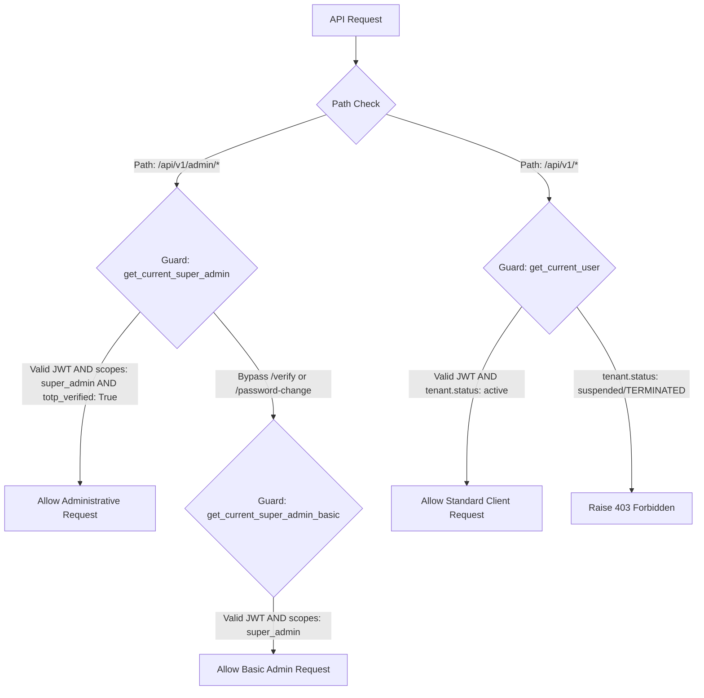

# Role-Based Access Control (RBAC) Specification

This document outlines the security controls, JWT scopes, and Role-Based Access Control boundaries implemented in the ReplyOS platform.

---

## 1. System Role Matrix

ReplyOS defines three primary user roles to enforce access controls across tenant and administrative boundaries:

| Role | Domain Scope | Permissions | Target Group |
| :--- | :--- | :--- | :--- |
| **`member`** | Tenant Space | Read logs, view chats, manually override chatbot and send chat messages. | Support agents, sales reps. |
| **`owner`** | Tenant Space | Full tenant operations: manage chatbots, RAG manuals, campaigns, subscriptions. | Tenant owners, managers. |
| **`admin`** | Global Platform | Complete SaaS control plane operations: tenants, billing, infrastructure, security. | SaaS owner/operator. |

---

## 2. Authentication Scopes & JWT Claims

ReplyOS separates customer sessions from administrative sessions by enforcing strict JWT scope validation:

### 2.1 Customer JWT Claims
Issued to normal tenant users (`member` or `owner` role) logging in via `/api/v1/auth/login`:
```json
{
  "sub": "user-uuid-12345",
  "exp": 1748729600
}
```
* Normal tenant endpoints decode this token, query the database `User` table, and verify their `tenant_id` to enforce data isolation.

### 2.2 Super Admin JWT Claims
Issued ONLY to global system administrators (`admin` role) logging in via `/api/v1/admin/auth/login`:
```json
{
  "sub": "admin-uuid-99999",
  "scopes": ["super_admin"],
  "totp_verified": true,
  "exp": 1748729600
}
```
* **`scopes`**: Must include `"super_admin"` to hit control plane endpoints. Normal user tokens are instantly rejected.
* **`totp_verified`**: Enforces 2FA status. If `User.totp_enabled` is True but this claim is False, the API blocks all administrative actions.

---

## 3. Server-Side Guard Middleware

FastAPI routes enforce security constraints using standard dependency injection gates:



### 3.1 `get_current_user`
Used by standard client endpoints. It decodes the JWT, verifies the user exists and is active, and **asserts that their parent Tenant space status is not suspended or terminated**. If the tenant space is disabled, it raises a `403 Forbidden` block, preventing all tenant activity immediately.

### 3.2 `get_current_super_admin_basic`
Used by setup endpoints (like `/admin/auth/password-change` or `/admin/auth/totp/verify`). It decodes the JWT and asserts that `user.role == "admin"` and `scopes` includes `"super_admin"`. It **bypasses** 2FA and forced password rotation blocks.

### 3.3 `get_current_super_admin`
Used by general control plane endpoints. It depends on `get_current_super_admin_basic` and **enforces that `must_change_password` is False and `totp_verified` is True**. This blocks all access to statistics, tenant lists, and telemetry dials until the administrator has completed their full authentication challenge.

---

## 4. Client-Side Security Isolation

To prevent session crosstalk or accidental data leaks, the Next.js frontend implements complete isolation:
* **Storage Isolation**: Client tokens are stored in `localStorage` under `saas_token`. Super Admin tokens are stored under `replyos_admin_token`.
* **Path-Aware Dynamic Fetch**: The frontend `ApiClient` automatically swaps tokens. If window pathname starts with `/admin`, it transmits `replyos_admin_token`. Otherwise, it transmits `saas_token`.
* **Logout & Expiry Routing**: Path-aware session clears ensure that client expiries redirect to `/login` while admin expiries redirect to `/admin/login`.
