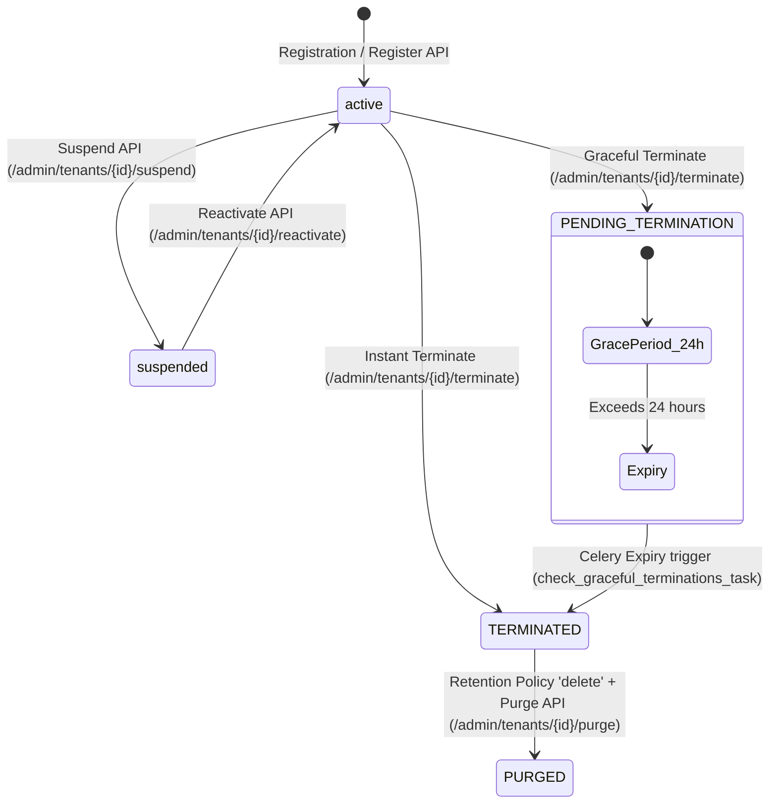

# Tenant Lifecycle Management Specification

This document details the lifecycles, states, and administrative state transition logic enforced across all organization workspaces in the ReplyOS WhatsApp SaaS platform.

---

## 1. Lifecycle State Machine Matrix

Every tenant in ReplyOS resides in one of the following states:

| State | User Logins | Campaigns | AI Chatbots | API Access | WhatsApp Session | Description |
| :--- | :--- | :--- | :--- | :--- | :--- | :--- |
| **`active`** | ✅ Enabled | ✅ Enabled | ✅ Enabled | ✅ Enabled | ✅ Connected | Normal operational tenant space. |
| **`suspended`** | ❌ Blocked | ❌ Paused | ❌ Bypassed | ❌ Blocked | ❌ Disconnected | Administrative suspension. Logins blocked, actions bypassed. |
| **`PENDING TERMINATION`** | ✅ Enabled | ✅ Enabled | ✅ Enabled | ✅ Enabled | ✅ Connected | Graceful termination mode (24h clock). Export tools enabled. |
| **`TERMINATED`** | ❌ Blocked | ❌ Paused | ❌ Bypassed | ❌ Blocked | ❌ Disconnected | Exceeded grace period or instantly shut. All services disabled. |
| **`PURGED`** | ❌ Deleted | ❌ Deleted | ❌ Deleted | ❌ Deleted | ❌ Deleted | Transactional hard purge. All database records and files deleted. |

---

## 2. State Transition Triggers

### 2.1 Active -> Suspended
* **Endpoint**: `POST /admin/tenants/{id}/suspend`
* **Triggers**: Admin manual action or past-due billing renewals.
* **Effects**:
  1. Sets `Tenant.status = "suspended"`.
  2. Sets `User.is_active = False` for all users associated with the tenant.
  3. Sets `Subscription.status = "suspended"`.
  4. Subsequent logins and API calls instantly fail.

### 2.2 Suspended -> Active
* **Endpoint**: `POST /admin/tenants/{id}/reactivate`
* **Triggers**: Manual override or successful billing capture.
* **Effects**:
  1. Sets `Tenant.status = "active"`.
  2. Sets `User.is_active = True` for all tenant members.
  3. Restores `Subscription.status = "active"`.

### 2.3 Active -> Pending Termination (Graceful Mode)
* **Endpoint**: `POST /admin/tenants/{id}/terminate` with payload `mode: "graceful"`.
* **Effects**:
  1. Sets `Tenant.status = "PENDING TERMINATION"`.
  2. Sets `Tenant.termination_grace_period_ends = datetime.utcnow() + timedelta(hours=24)`.
  3. Dispatches warning banners via WebSockets: *"Your tenant space is scheduled for termination in 24 hours. Please export data immediately."*
  4. Client dashboard functions (AI replies, API calls, campaign dispatches) remain active, allowing them to download history, files, and templates.

### 2.4 Pending Termination -> Terminated
* **Trigger**: Celery Periodic Daemon `check_graceful_terminations_task` executes and finds grace duration is expired.
* **Effects**:
  1. Sets `Tenant.status = "TERMINATED"`.
  2. Locks all logins (`is_active = False`).
  3. Pauses campaigns, halts chatbot replies, and suspends subscriptions.
  4. Calls WhatsApp Engine (`DELETE /sessions/{sess_id}`) to disconnect active phone numbers.
  5. Checks `data_retention_policy`. If set to `"delete"`, it automatically purges all records (see section 3).

---

## 3. Data Retention Policies

ReplyOS supports two data retention modes to comply with enterprise standards:

### 3.1 Archive Mode
* **Configuration**: `Tenant.data_retention_policy = "archive"`
* **Behavior**: For terminated spaces, all conversations, campaigns, contacts, sessions, and files are permanently retained in database logs. Data is hidden from client portals but preserved for SaaS records.

### 3.2 Delete Mode
* **Configuration**: `Tenant.data_retention_policy = "delete"`
* **Behavior**: On termination expiry or manual purge `/admin/tenants/{id}/purge`, the system performs an immediate transactional hard purge:
  1. Deletes physical uploads (PDF, text manuals) from local directory storage (`os.remove`).
  2. ORM cascading executes a single database transaction deleting the primary `tenants` record.
  3. Cascading foreign keys instantly wipe:
     * `users`, `subscriptions`, `payment_transactions`, `billing_history`
     * `whatsapp_sessions`, `chatbots`, `conversations`, `messages`
     * `knowledge_bases`, `kb_documents`, `kb_document_chunks` (pgvector chunks)
     * `campaigns`, `campaign_logs`, `ai_usage_logs`, `audit_logs`
  4. Erases matching connection queues and session cache buffers in Redis.
