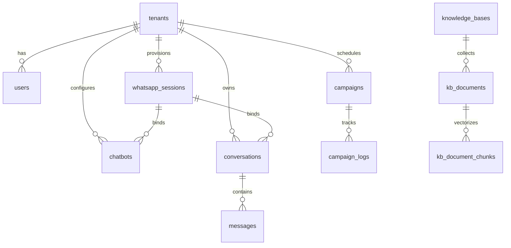

# System Architecture Map & Engineering Blueprint

This document outlines the complete architectural design, network topology, event pipelines, and storage schemas of the WhatsApp AI SaaS Platform.

---

## 1. Network & Container Topology

The application runs in a containerized environment managed via Docker Compose. Traffic enters the VM via ports `8080` (HTTP) and `8443` (HTTPS) to the Nginx reverse proxy.

```
                  +---------------------------------------+
                  |           Nginx Proxy (8080)          |
                  +------------------+--------------------+
                                     |
             +-----------------------+-----------------------+
             |                                               |
             v (/api/v1/*)                                   v (/*)
+------------+------------+                     +------------+------------+
|  FastAPI Backend (8000) |                     |   Next.js Frontend      |
+------------+------------+                     +-------------------------+
             |
     +-------+-------+-----------------------+
     |               |                       |
     v               v                       v
+----+----+    +-----+-----+           +-----+-----+
|  Redis  |    | Postgres  |           | WhatsApp  |
|  (6379) |    |  (5432)   |           |  Engine   |
+----+----+    +-----+-----+           +-----+-----+
     ^               ^                       | (Webhooks)
     |               |                       |
     +--------+------+-----------------------+
              |
              |
       +------+------+
       |   Celery    | <=====> Ollama (11434)
       |   Worker    |
       +-------------+
```

### Port Mappings Table
* **`8080`**: Nginx HTTP Gateway (mapped to inner Port 80)
* **`8443`**: Nginx HTTPS Gateway (mapped to inner Port 443)
* **`30000`**: Direct Next.js SSR (development port, mapped to inner Port 3000)
* **`11434`**: Ollama Local Inference (bound to localhost inside the docker bridge network)
* **`3000`**: WhatsApp Engine inner Express port (mapped host port 3000)

---

## 2. Component Architecture Deep Dive

### A. FastAPI Backend Core
- **Framework**: FastAPI (Asynchronous ASGI using Uvicorn)
- **Database Driver**: SQLAlchemy + asyncpg (Asynchronous PostgreSQL adapter)
- **Object Serialization**: Pydantic v2
- **Auth**: JWT Bearer Tokens with `tenant_id` claims, cryptography powered by `passlib[bcrypt]` (pinned `bcrypt==3.2.2`).

### B. Node.js WhatsApp Engine
- **Framework**: Express.js + TypeScript
- **Protocol Driver**: `@whiskeysockets/baileys` (Multi-session WhatsApp Web WebSocket implementation)
- **Auth Storage**: Stateful sessions are eliminated. Authentication data is packed into a Postgres-backed JSON store in the `whatsapp_sessions` table.
- **Webhooks**: Dispatches raw inbound text messages and session status changes back to the FastAPI `/api/v1/sessions/webhook` endpoint.

### C. Background Task Pipeline (Celery + Redis)
- **Broker & Backend**: Redis (`saas_redis` container)
- **Concurrency Pool**: Celery workers run with `concurrency=2` to protect ARM CPU memory limits on Oracle Free Tier.
- **Task Types**:
  1. `process_kb_document_chunking`: Vectorizes uploaded PDF text chunks using local embedding drivers and persists outputs.
  2. `dispatch_marketing_campaigns`: Sequentially fires scheduled templates to campaign recipient logs.

---

## 3. Database Schema Blueprint



### PostgreSQL Table Summary
1. **`tenants`**: Enterprise/Personal account containers separating users, settings, and bots.
2. **`users`**: User profiles with bcrypt-hashed passwords mapped to distinct tenants.
3. **`whatsapp_sessions`**: Session configurations holding active statuses, QR codes, and Baileys authentication blobs.
4. **`chatbots`**: Custom configurations for the AI bots, including system prompts and Ollama model options.
5. **`knowledge_bases`**: RAG storage catalogs separating PDF catalogs.
6. **`kb_document_chunks`**: Individual text blocks with their `vector(384)` embeddings.
7. **`conversations`**: Aggregated customer threads normalized by phone number.
8. **`messages`**: Log of both inbound and outbound messages.
9. **`campaign_logs`**: Tracking analytics for the outbound broadcast loops.

---

## 4. Key Event Flows & Orchestration Pipelines

### A. WhatsApp Event Pipeline (Inbound Message to AI Reply)
When a customer sends a message to the connected WhatsApp account:

```
[Customer Mobile]
       │ (Sends WhatsApp Message)
       ▼
[WhatsApp Servers]
       │
       ▼ (Socket Connection)
[WhatsApp Engine (Baileys)] 
       │ (Extracts sender JID, message content)
       ▼ (POSTs Event Webhook)
[FastAPI Backend /sessions/webhook]
       │ (Saves Inbound Message to DB, queries active bot setup)
       ▼ (Triggers Celery Worker async)
[Celery AI RAG Task]
       │ (1. Cosine similarity query on pgvector for RAG context)
       │ (2. Compiles system prompt + history + facts)
       │ (3. Calls Ollama /api/chat for generation)
       ▼ (POSTs AI Response back)
[WhatsApp Engine /sessions/send]
       │ (Injects Anti-Ban Queue simulation)
       ▼ (Socket dispatch)
[Customer Mobile]
```

### B. Session Ownership Flow
- Sessions are owned by a `tenant_id`.
- The WhatsApp Engine allows registering multiple dynamic socket instances.
- Each socket instance connects using a unique `session_id` (UUID).
- Standard session initialization flow:
  1. FastAPI `POST /sessions/initialize` requests new socket instantiation in WhatsApp Engine.
  2. Engine creates socket, listens to `connection.update` and `creds.update`.
  3. Connection returns QR code string which is saved directly to `whatsapp_sessions.qr_code`.
  4. The frontend pulls this QR code and renders it on a Canvas component.
  5. Once scanned, `creds.update` serializes authentication arrays to Postgres, updating status to `connected`.

### C. Outbound Campaign Dispatch Loop
1. User schedules a campaign with specific recipient numbers via frontend.
2. The campaign configuration stores raw recipient lists and templates in PostgreSQL.
3. Every 60 seconds, Celery beat (or scheduler) queries campaigns whose `scheduled_time` is past due.
4. Celery fires `dispatch_marketing_campaigns` task.
5. The worker pulls recipients, processes templates with merge variables, and publishes messages to the WhatsApp Engine.
6. The engine passes dispatches through the `AntiBanQueue` dispatcher, which spaces out messages randomly (4s–8s) to prevent bulk spam triggers on WhatsApp networks.

---

## 5. Tenant Isolation Strategy

Multi-tenancy is structured at the application layer:
* **Storage Isolation**: All tables have a mandatory `tenant_id` column. Unique composite indexes (e.g., `unique_tenant_phone`) ensure clean structural partitions.
* **Query Isolation (FastAPI)**: Row-Level Security (RLS) is achieved programmatically inside repositories and routers. Every request is filtered by the user's `tenant_id` parsed out of the JWT claims. No queries are run without a `WHERE tenant_id = :tenant_id` filter.
* **Socket Isolation**: Baileys socket workers operate as separate dynamic objects within the JS engine. They operate strictly under their matching `session_id` bounds and save event callbacks back to their respective tenant-owned database tables.
