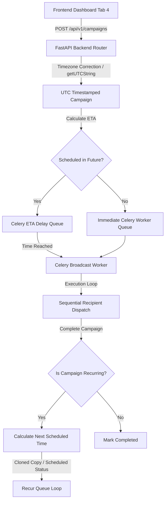

# Campaign Scheduler System Architecture

This document specifies the technical design, queuing mechanics, and execution lifecycle of the Campaign Scheduler within ReplyOS.

## Core Mechanisms



### 1. Timezone-Aware Scheduled ISO Generation
The frontend uses standard timezone-agnostic fields (Date and Time pickers) and a Timezone selector. It resolves the absolute epoch offset using a robust client-side UTC normalizer:
* Generates a virtual UTC date representation.
* Formats this target in the client-selected timezone (e.g., `Asia/Kolkata`, `America/New_York`).
* Compares the localized output with UTC to extract exact hour and minute shifts.
* Outputs a normalized ISO timestamp (`YYYY-MM-DDTHH:MM:SS.000Z`) to the API.

### 2. FastAPI Router Scheduling
Upon receiving the campaign creation payload:
* The backend parses the normalized `scheduled_time` ISO string.
* It compares it against `datetime.now(timezone.utc)`.
* If `scheduled_time` is in the future:
  - Dispatches a Celery task with the `eta` parameter set to the exact UTC timestamp:
    ```python
    celery.send_task(
        "worker.tasks.run_campaign_broadcast_task",
        args=[str(new_campaign.id)],
        eta=sched_time
    )
    ```
* If immediate:
  - Dispatches without `eta` to execute instantly on the Celery message queue.

### 3. Celery Campaign Worker Execution Loop
The Celery worker sequentially runs `run_campaign_broadcast_task`:
* **State Updates**: Sets campaign status to `sending` and pushes updates to connected clients via Redis PubSub WebSockets.
* **Quota Validation**: Verifies active subscription status and monthly message usage thresholds prior to sending each message.
* **Database & Delay Sync**: Fetches user-customized delivery delay configurations (`campaign_send_interval`, `reply_delay`, `simulate_typing_delay`) to control anti-ban behavior dynamically.
* **Individual Dispatches**: Triggers the Node WhatsApp Engine message command via the session service, passing the campaign log ID as the message ID.
* **Safe Cooldown**: Sleeps for `campaign_send_interval` seconds (Anti-ban jitter delay) between dispatches to mimic human speed:
  ```python
  time.sleep(send_interval)
  ```

### 4. Recurrence Lifecycle & Duplication Loop
If a campaign is configured as recurring (`recurring_interval` is `"hourly"`, `"daily"`, or `"weekly"`):
* On campaign broadcast completion, the worker calculates the `next_time` using the current `scheduled_time` plus a standard interval:
  - **hourly**: `timedelta(hours=1)`
  - **daily**: `timedelta(days=1)`
  - **weekly**: `timedelta(days=7)`
* Checks if a cloned copy is already queued to prevent double scheduling.
* Creates a new cloned `Campaign` record with the status `"scheduled"`, copying the name, template text, sender session ID, and recurring interval.
* Bulk replicates the list of pending recipients to the new child campaign logs.
* Enqueues the new task in the Celery broker using the calculated future `eta`.

---

> [!NOTE]
> All Celery scheduled campaigns persist in the PostgreSQL database as `"scheduled"`. In the event of a worker container reboot, scheduled jobs will be fetched and re-queued by the background worker daemon to guarantee zero lost dispatches.

> [!TIP]
> Setting the "Schedule Type" to "Send Instantly" sets the execution ETA to `None`, which bypasses the scheduler and immediately delivers the marketing messages.
