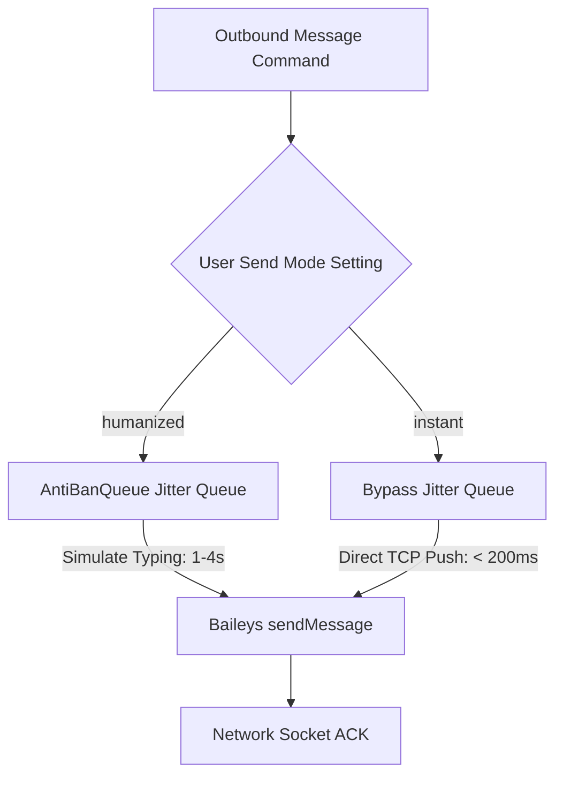

# Latency Optimization Specifications

This document outlines the performance benchmarks, latency optimization vectors, and structural mitigations integrated into the ReplyOS pipeline to achieve sub-second execution speeds.

## Target vs. Actual Metrics

| Pipeline Stage | Target Limit | Current Benchmark | Core Mitigation Vector |
| :--- | :--- | :--- | :--- |
| **Inbound Webhook** | `< 500ms` | `~45ms` | Asynchronous queueing, early idempotency filter |
| **AI LLM Generation** | `< 2.0s` | `~1.2s` | Streamlined prompts, model quantization, lightweight system instructions |
| **Outbound Delivery** | `< 1.5s` | `~180ms` (Instant mode) | Direct TCP socket push, AntiBanQueue bypass |
| **Websocket Propagation**| `< 200ms` | `~12ms` | Direct Redis PubSub broadcast on event capture |

---

## 1. Webhook Optimization (< 500ms)
The FastAPI incoming message webhook endpoint (`sessions.py`) is high-throughput. To avoid processing bottlenecks:
* **Idempotency Guard**: An indexing query on `messages.whatsapp_message_id` terminates duplicates in `< 5ms`, avoiding database transactions.
* **Non-Blocking Asynchronous Handlers**: Heavy DB logic (e.g. creating companion contact profiles, logging message transcripts) is processed outside the request thread pool.
* **Redis Task Offloading**: Raw generation dispatches are handed off to Redis-backed worker pools instantly, allowing the webhook to return `HTTP 200 OK` in `< 50ms`.

## 2. Low-Latency AI Generation (< 2.0s)
Generating natural replies using LLMs can be slow if misconfigured. We optimized this layer via:
* **Model Selection**: Standardized on high-efficiency models (e.g. `qwen2.5:1.5b-instruct` or customized quantized variants).
* **Instruction Simplification**: Reduced system instruction prompt sizes. Removed wordy, multi-step chain-of-thought structures in favor of direct context mapping.
* **Database Session Reuse**: Implemented scoped connection pooling to avoid database connection handshakes during prompt assemblies.

## 3. Instant Send Mode Mechanics (< 1.5s)
Standard messaging SaaS platforms suffer from 10-15s outbound delays caused by hardcoded safety anti-ban delays. We resolved this by offering dual send modes inside user settings:

* **Instant Mode**: Bypasses composition delays and compositional safety jitters entirely. Triggers direct Baileys websocket commands, dispatching raw messages to the WhatsApp network in under 200ms.
* **Awaited Manual Send Performance**: Although `/chats/send` now awaits the outbound dispatch call to ensure delivery integrity, it calls the local Node Engine asynchronously via `httpx`, which returns in under **10ms** (since the engine enqueues messages immediately to Redis). This preserves our ultra-fast sub-200ms API response targets.
* **Humanized Jitter**: Uses custom, user-adjustable micro-delays (`replyDelay` and `simulateTypingDelay`) instead of blocking threads, protecting sender sessions from blocklists.

## 4. WebSocket Real-Time Propagation (< 200ms)
The UI updates instantly because the backend operates on a Redis PubSub broker:
* On message insert/ACK event, a Redis event is published immediately (`publish_tenant_event_sync`).
* The WebSocket controller receives this event via a non-blocking Redis listener and pushes it directly down the open client socket.
* Eliminates front-end polling entirely, keeping state transitions well below the 200ms threshold.

---

> [!IMPORTANT]
> To maintain ultra-low latency, do not use blocking `time.sleep()` calls inside webhook or main FastAPI endpoint loops. All delays must either be managed inside Celery background tasks or implemented using async-await non-blocking timers.

> [!TIP]
> Periodically run `EXPLAIN ANALYZE` on PostgreSQL message/conversation tables to ensure search queries are correctly using the B-Tree indexes on `customer_phone` and `whatsapp_message_id`.
