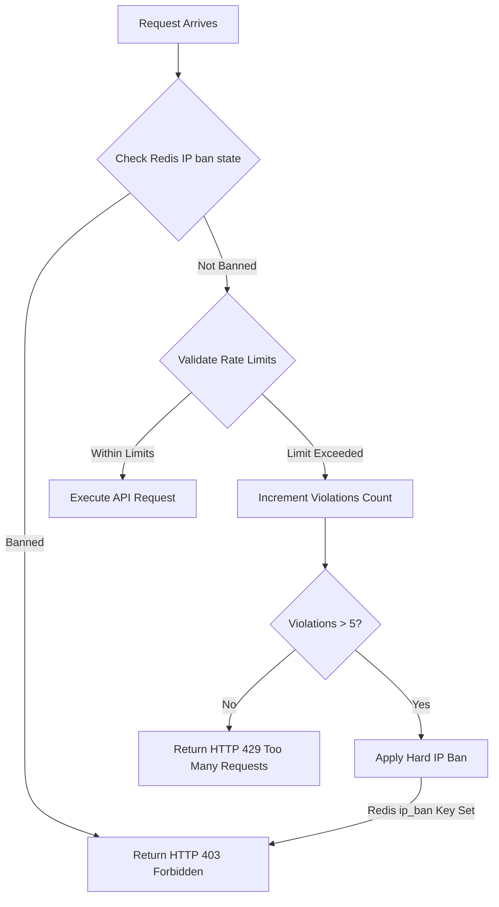

# Master Admin Security & Rate Limiting Specifications

This document defines the cryptographic constraints, progressive rate limiting, and brute-force block protection applied across all Master Admin scopes.

---

## 1. Cryptographic JWT Hardening

Administrative authorization relies on cryptographically signed JWT tokens:
* **Asymmetric Signatures**: Decoded strictly using SHA-256 signatures with host environment `JWT_SECRET` key constraints.
* **Token Expiration**: Token lifetimes are restricted to a maximum of **12 hours** to reduce the window of opportunity for leaked credentials.
* **Impersonation Auditing**: When an administrator impersonates a tenant user for debugging, the generated JWT token contains a specific `is_impersonated: true` claim flag. This claim restricts payment modifications and logs all actions inside the activity database as an administrative bypass.

---

## 2. Sliding-Window Rate Limiting

To prevent brute-force attacks and denial-of-service (DoS) exploits against administrative login and search controllers, the API applies a Redis-backed sliding-window rate limiter.

### Limit Configurations
* **Admin Login Route**: Restricted to a maximum of **5 attempts per minute** per IP address.
* **Admin Metrics Route**: Restricted to a maximum of **60 requests per minute** per IP address.

### Redis Keys Structure
Every request increment is recorded inside a Redis sorted set `rate_limit:[IP_ADDRESS]`:
```text
Key: rate_limit:127.0.0.1
Value (ZSET): [timestamp_index]
```

---

## 3. Progressive IP Bans & Block Rules

When an IP address repeatedly violates rate boundaries, the system escalates the lock state to a hard progressive ban.



### Escalating Lock Cooldowns
1. **First Violation**: Standard `429 Too Many Requests` warning.
2. **Standard Ban (Violations > 5)**: Hard IP ban in Redis for **30 minutes** (`ip_ban:[IP_ADDRESS]`).
3. **Enterprise Ban (Violations > 10)**: Dynamic escalation to **24-hour** IP ban.

---

## 4. Administrative Activity & Audit Logs

All changes to tenants, quota updates, plan overrides, and emergency shutdowns are committed to the central `activity_logs` table in PostgreSQL.

### Log Audit Payload
Every admin action records the following parameter payload:
* `admin_user_id`: UUID of the operator.
* `action_type`: E.g. `"tenant_suspended"`, `"quota_overriden"`, `"emergency_shutdown"`.
* `target_tenant_id`: UUID of the affected tenant.
* `payload`: JSON block detailing "Before" vs "After" state values.
* `timestamp`: ISO UTC timestamp.
