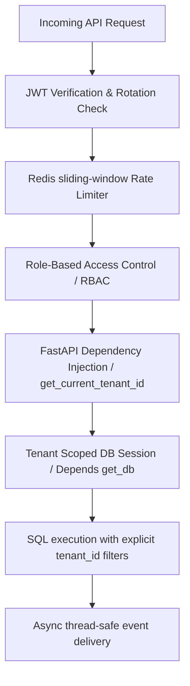

# API Hardening & Security Specifications

This document outlines the security parameters, transactional safeguards, and isolation layers deployed across the ReplyOS FastAPI gateway.

## Core Security Safeguards



---

## 1. Asynchronous Thread-Safety

FastAPI runs standard synchronous routes (`def`) inside a background worker thread pool (`anyio.to_thread`). This presents critical thread-safety challenges when interacting with asyncio event loops:
* **Failure Vectors**: Calling asynchronous subroutines (like `websocket_manager.publish_event`) inside synchronous thread workers throws `RuntimeError: no running event loop`.
* **Mitigation**: All API routes performing messaging actions, WebSocket dispatches, or task integrations are declared strictly as `async def`. This binds execution directly to the main loop, eliminating runtime errors and context corruption.

## 2. Dynamic Transaction Boundaries

Database integrity is protected via clear transaction isolation rules:
* Scoped Sessions: Databases are initialized with explicit transaction scopes.
* Atomic Try/Except Rolls: Every write route wraps SQLAlchemy updates inside scoped transactional handles:
  ```python
  try:
      db.commit()
  except Exception as e:
      db.rollback()
      raise HTTPException(status_code=500, detail="Database write failure.")
  ```
* Rollbacks automatically flush connection states and return standard `500 Internal Server Error` payloads, protecting front-end consumers from crashes.

## 3. Strict Multi-Tenant Isolation (RBAC)

Tenant boundaries are enforced directly in the database query layer:
* **JWT Tenant Context**: Authentication headers inject the validated tenant identity into the request scope:
  ```python
  tenant_id: UUID = Depends(get_current_tenant_id)
  ```
* **Forced Identity Matching**: All updates, deletions, and queries must cross-reference this token against database primary keys:
  ```python
  db.query(Conversation).filter(
      Conversation.id == conversation_id,
      Conversation.tenant_id == tenant_id
  )
  ```
* Bypassing or modifying rows belonging to different tenant UUIDs results in immediate `404 Not Found` or `401 Unauthorized` responses.

---

> [!IMPORTANT]
> Never access or mutate database tables without explicitly including the `tenant_id` constraint, even during bulk administrative triggers, to prevent data leakages.

> [!TIP]
> Periodically rotate secret environment keys (`JWT_SECRET`) and verify Redis connection limits to protect sliding-window rate limit counters under high enterprise loads.
