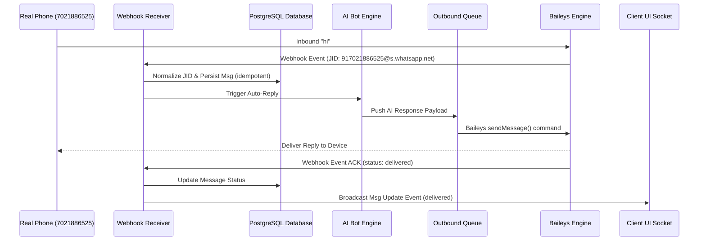

# Real Phone Runtime Testing Protocols

This document specifies the mandatory, end-to-end integration testing loops required to validate real-world message delivery, canonical JID resolution, and outbound ACK tracking in production environments.

## Testing Configuration

* **Mandatory Test Number**: `917021886525` / `7021886525`
* **Canonical Target JID**: `917021886525@s.whatsapp.net`
* **Test Cycle Max Timeout**: `60 Seconds`
* **Expected State Transitions**: `queued` ➔ `sending` ➔ `sent` ➔ `delivered`

---

## 1. End-to-End Integration Test Loop



---

## 2. Step-by-Step Verification Protocol

### Step 1: Send Inbound Message
* Action: From the physical WhatsApp device (`+917021886525`), send a text message containing `"hi"` or `"pricing options"`.
* Expected Result: The local Baileys node container catches the incoming payload instantly and forwards it to the Python webhook receiver.

### Step 2: Validate Canonical JID Normalization
* Action: Inspect Nginx/FastAPI logs to ensure the webhook catches the incoming request and normalizes the phone identifier:
  ```bash
  tail -f ~/whatsapp-ai-saas/logs/app.log | grep "normalize_jid"
  ```
* Expected Result: Converts any incoming format (`+917021886525`, `7021886525`, `917021886525:1234@s.whatsapp.net`) strictly into `917021886525@s.whatsapp.net`.
* No duplicate conversations or placeholder contact names (like `Guest User`) should be created.

### Step 3: AI Reply Generation
* Action: Verify the AI context extraction. If the bot is active and unpaused, the LLM constructs an answer matching catalog/FAQ materials in `< 2s`.
* Expected Result: An outbound message record is created in the database and set to `queued` status.

### Step 4: Verify Outbound Execution & Jitter
* Action: Check background Celery logs for campaign/bot sends:
  ```bash
  docker compose logs saas_worker -f --tail=50
  ```
* Expected Result: The worker fetches current tenant settings, extracts the active delay parameters, and dispatches the Baileys request.

### Step 5: Validate ACK Transitions & Real Receipt
* Action: Confirm that the real phone receives the message text.
* Expected Result: The phone displays the reply. The Baileys engine receives the delivery confirmation (`ack: 2` or `ack: 3`) from the WhatsApp server, which triggers the `/api/v1/sessions/webhook` ACK route.
* The message's status in the database successfully changes to `delivered`.

---

## 3. Troubleshooting Matrix

| Symptom | Root Cause | Remediation |
| :--- | :--- | :--- |
| Message remains `queued` | Celery worker is offline or database connection is stale | Restart worker container: `docker compose restart worker` |
| Webhook raises `IntegrityError` | Webhook retries caused duplicate primary key insertions | Verify early `existing_msg` check logic in `sessions.py` |
| Bot fails to reply | Chat session has `bot_paused_until` set in the future | Reset bot pause duration in settings or clear column in PG |
| Multiple conversation lines | Frontend generated a temporary ID instead of using canonical JID | Ensure frontend component only queries/creates chats using the output of `normalize_jid` |

---

> [!WARNING]
> Do not mark any test iteration as a "Success" until the physical test device receives the text bubble and the message status is updated to `delivered` in the PostgreSQL database.
