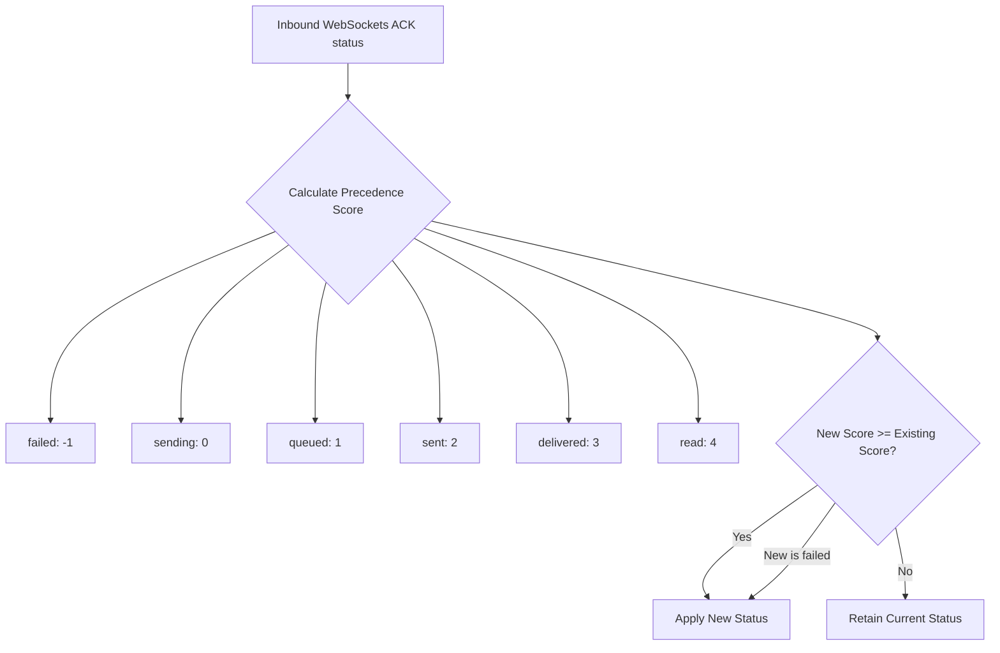

# Conversation Engine Specifications

## 2026-05-29 Strict Runtime Gate

Conversation creation is now blocked unless `customer_phone` is produced by `normalize_jid()`.

Bad prior flow:

```text
Baileys remoteJid -> from=185654373789739 -> normalize_jid accepted -> conversations.customer_phone -> websocket -> frontend map/render
```

Corrected flow:

```text
Baileys remoteJid -> backend normalize_jid -> valid 91xxxxxxxxxx@s.whatsapp.net only -> create/update conversation -> websocket
```

If normalization raises `ValueError`, `sessions.py` logs `from`, `rawRemoteJid`, and `rawParticipant`, then returns before creating a conversation, message, AI reply, delivery dispatch, or websocket event.

This document defines the JID routing mechanics, client-side Map states, and event reconciliation rules of the ReplyOS Realtime Conversation Engine.

## 1. Centralized JID Normalization

To prevent conversation fragmentation and duplicate companion accounts, the system enforces a strict normalization policy.

### Normalization Pattern
Every JID must be resolved through `normalize_jid()` prior to database query, lookup, insert, or campaign queuing:

$$\text{Phone String} \xrightarrow{\text{normalize\_jid()}} \text{[digits]}@\text{s.whatsapp.net}$$

### Processing Logic
* **Delimiters and Delays**: All white spaces, plus symbols `+`, dashes `-`, parentheses `()`, and colon suffixes (companion port indicators like `:9739`) are completely stripped.
* **Indian Country Code Auto-Appending**: Automatically prepends country code `91` to any raw 10-digit Indian phone numbers (starting with 6, 7, 8, 9) to ensure valid, routable WhatsApp JIDs (e.g. `7021886525` -> `917021886525@s.whatsapp.net`).
* **Domain Check**: Ensures the string terminates strictly with the `@s.whatsapp.net` suffix.

---

## 2. Client-Side Normalized Map Store

To eliminate stale array indices and duplicate item lists, the frontend is rebuilt entirely around native ES6 `Map` states.

```typescript
// Defined in frontend DashboardPage
const [conversationsMap, setConversationsMap] = useState<Map<string, any>>(new Map());
const [messagesMap, setMessagesMap] = useState<Map<string, any>>(new Map());
```

### Derived Reactive Arrays
To preserve full layout compatibility, sorted arrays are dynamically derived from the Maps in the React render scope:

```typescript
const conversations = Array.from(conversationsMap.values()).sort(
  (a, b) => new Date(b.last_message_at).getTime() - new Date(a.last_message_at).getTime()
);

const messages = Array.from(messagesMap.values()).sort(
  (a, b) => new Date(a.created_at).getTime() - new Date(b.created_at).getTime()
);
```

---

## 3. Strict Deduplication & Message Reconciliation

Messages received via WebSocket or API dispatches are reconciled inside the Map store to reject duplicate events.

### Deduplication Vectors
1. **`message_id`**: Matches primary key UUIDs from PostgreSQL.
2. **`client_uuid`**: Matches optimistic IDs generated during manual agent override sends.
3. **`whatsapp_message_id`**: Matches network-level unique message IDs generated by WhatsApp.

---

## 4. WebSocket Status Precedence Rules

When out-of-order WebSocket status events arrive, state updates must respect precedence rules to prevent overwriting newer statuses with older ones:



### Code Implementation
```typescript
const statusPrecedence: Record<string, number> = {
  'failed': -1,
  'sending': 0,
  'queued': 1,
  'sent': 2,
  'delivered': 3,
  'read': 4
};
const curPrec = statusPrecedence[currentStatus] ?? 0;
const newPrec = statusPrecedence[newStatus] ?? 0;
const resolvedStatus = (newPrec >= curPrec || newStatus === 'failed') ? newStatus : curStatus;
```

---

> [!IMPORTANT]
> The derived `messages` and `conversations` arrays are automatically re-computed and re-rendered by React whenever `setMessagesMap` or `setConversationsMap` are called with a fresh Map reference.

> [!TIP]
> Keep `messagesMap` scoped strictly to the active conversation thread ID (`activeConv.id`). Switching active chats should flush the `messagesMap` and rebuild it.
