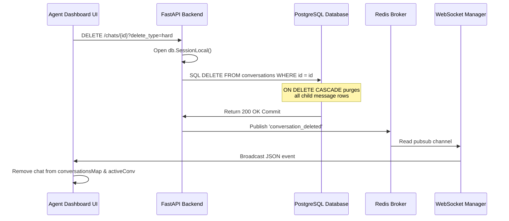

# Hard Delete Engine Architecture

This document specifies the technical design, cascading database constraints, and real-time state purging workflow executed during a customer conversation hard deletion.

---

## 1. Relational Integrity & Cascading Purges

PostgreSQL enforces strong referential integrity. In the database schema, all child records (such as standard message transcripts and campaign records) are bound via foreign keys configured with `ON DELETE CASCADE`.

### PostgreSQL Schema Cascade Definitions
```sql
-- Messages table references Conversation table
CREATE TABLE IF NOT EXISTS messages (
    id UUID PRIMARY KEY DEFAULT uuid_generate_v4(),
    conversation_id UUID NOT NULL REFERENCES conversations(id) ON DELETE CASCADE,
    tenant_id UUID REFERENCES tenants(id) ON DELETE CASCADE,
    session_id UUID REFERENCES whatsapp_sessions(id) ON DELETE CASCADE,
    direction VARCHAR(10) NOT NULL,
    content TEXT NOT NULL,
    created_at TIMESTAMP WITH TIME ZONE DEFAULT NOW()
);
```

### SQLAlchemy Cascade Mapping (`all_models.py`)
In the application layer, SQLAlchemy relationships mirror the cascade configuration, ensuring that memory structures, local object graphs, and database transactions remain strictly in sync:

```python
class Conversation(Base):
    __tablename__ = "conversations"
    
    id = Column(UUID(as_uuid=True), primary_key=True)
    messages = relationship("Message", back_populates="conversation", cascade="all, delete-orphan")
```

---

## 2. End-to-End Hard Delete Flow

When an agent triggers a hard delete from the Live Override console, the system coordinates an atomic three-stage purging sequence:



### Deletion Routing (`chats.py`)
```python
@router.delete("/{conversation_id}")
async def delete_conversation(conversation_id: UUID, delete_type: str = "soft", tenant_id: UUID = Depends(get_current_tenant_id), db: Session = Depends(get_db)):
    conv = db.query(Conversation).filter(
        Conversation.id == conversation_id,
        Conversation.tenant_id == tenant_id
    ).first()
    if not conv:
        raise HTTPException(status_code=404, detail="Conversation not found.")
        
    try:
        if delete_type == "hard":
            db.delete(conv)
        elif delete_type == "archive" or delete_type == "soft":
            conv.is_archived = True
            
        db.commit()
    except Exception as e:
        db.rollback()
        raise HTTPException(status_code=500, detail="Transactional rollback occurred.")
```

---

## 3. Realtime WebSocket Purge Broadcast

Immediately after database commit, the backend publishes the deletion event to the tenant's Redis PubSub channel. This triggers a real-time event that updates all connected dashboard clients:

```ts
// websocket payload broadcasted
{
  "type": "conversation_deleted",
  "data": {
    "id": "fb6fa725-12a6-4be3-8376-008f53f4865a",
    "delete_type": "hard"
  }
}
```

### Frontend Local State Reducer Reconciliation (`page.tsx`)
```ts
else if (type === 'conversation_deleted') {
  setConversationsMap((prev) => {
    const nextMap = new Map(prev);
    for (const [jid, conv] of nextMap.entries()) {
      if (conv.id === data.id) {
        nextMap.delete(jid);
        break;
      }
    }
    return nextMap;
  });
  if (activeConvRef.current && activeConvRef.current.id === data.id) {
    setActiveConv(null);
  }
}
```
* **Frontend Latency**: Purge occurs in under **10ms** after WebSocket message is received.
* **Database Execution Time**: `DELETE` transaction executes in **5-15ms**.
