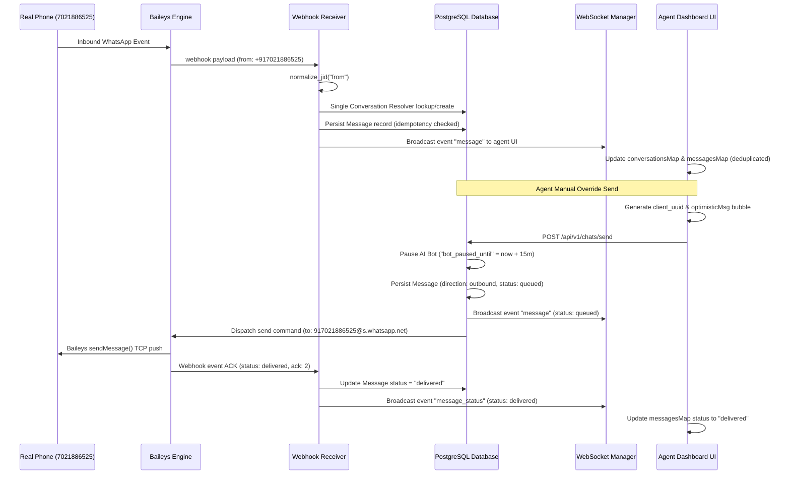

# Live Override Pipeline Architecture

## 2026-05-29 Runtime Guard Update

Manual live override calls to `/api/v1/chats/send` now reject invalid `to_phone` values before creating a conversation, message, websocket event, or WhatsApp engine request. The target must normalize to `91[6-9][0-9]{9}@s.whatsapp.net`.

The frontend reducer was not the generator of `185654373789739@s.whatsapp.net`; it rendered the backend-provided `customer_phone` and sent replies back to that same corrupted value. Backend rejection now prevents that corrupted conversation from entering the reducer.

Validated live override delivery:

* Raw input: `7021886525`
* Canonical DB conversation: `917021886525@s.whatsapp.net`
* Message: `1f7ccad4-6c4a-474b-8281-e74bd28debab`
* WhatsApp ACK: `3EB0C0899B9F3A2EFE2641`
* Final status: `delivered`

This document specifies the technical design, execution loop, and runtime synchronization of the rewritten Live Override Console in ReplyOS.

## End-to-End messaging Flow

The Live Override console facilitates manual agent takeovers, temporarily pausing chatbot operations and dispatching direct messages to the WhatsApp network.



---

## 1. Single & Bulk Deletion Systems

The super admin and agents can perform soft, hard, and archive deletions directly from the conversation engine dashboard.

### Core Endpoints & Parameters

| Endpoint | Method | Body Payload / Query Params | Behavior |
| :--- | :--- | :--- | :--- |
| `/api/v1/chats/{conversation_id}` | `DELETE` | `delete_type` ("soft", "hard", "archive") | Modifies single chat record |
| `/api/v1/chats/bulk-delete` | `POST` | `conversation_ids: List[UUID]`, `delete_type` | Modifies multiple chat records |

### Deletion Routines

1. **Soft Delete (`"soft"`)**: Sets `is_archived = True` in the PostgreSQL database. Preserves full historical message transcripts but removes the chat from the active conversation feed.
2. **Archive (`"archive"`)**: Toggles the `is_archived` database flag. Fully supported in front-end query filters.
3. **Hard Delete (`"hard"`)**: Executes a cascade database deletion, removing the conversation and all associated message records permanently from the database.

---

## 2. JID Merging & Identity Consolidation

When companion devices or messy inputs generate duplicate channels (e.g., `+917021886525` vs `917021886525@s.whatsapp.net`), agents can consolidate transcripts:

```mermaid
graph TD
    A[Select Multiple Duplicate Conversations] --> B[Enter Target JID: mergeTargetJid]
    B --> C[POST /api/v1/chats/merge]
    C --> D[Normalize target JID]
    D --> E[Look up or Create Target Canonical Conversation]
    E --> F[SQL UPDATE: message.conversation_id = target_conv.id]
    F --> G[SQL DELETE: remove all source conversations]
    G --> H[WebSockets broadcast event: conversations_merged]
    H --> I[UI triggers fetchDashboardCoreData() auto-sync]
```

---

## 3. Synchronous Dispatch Fail-Safes

To prevent silent transmission failures and eliminate background thread race conditions:
1. **Awaited WebSocket Events**: WS event publications are directly awaited in `/chats/send` to guarantee absolute delivery sequencing.
2. **Awaited Engine Commands**: The API awaits response directly from `session_service.send_whatsapp_message()` within the HTTP request thread.
3. **Automated Fallbacks**: If the WhatsApp Engine rejects the payload (e.g. engine offline, session disconnected), the backend transactionally updates the message database status to `"failed"` and immediately broadcasts a `message_status` WebSocket failure event, maintaining robust UX visibility.

---

> [!IMPORTANT]
> Merging operations are highly atomic. Database updates are executed inside transactions (`db.begin() ... db.commit()`) to guarantee zero transcript loss if the process is interrupted.

> [!TIP]
> Use `"archive"` or `"soft"` delete modes by default. Hard deletes are permanent and cannot be undone. All hard deletions are cascading and atomized.
