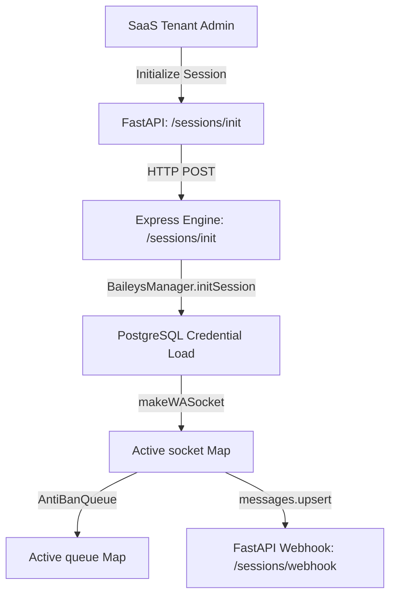

# WhatsApp Session Identity & Binding System

This document specifies the multi-tenant session identity architecture, active socket binding, and dynamic routing used inside the Baileys coordinator engine.

---

## 1. Multi-Tenant Session Registry

Every tenant inside the SaaS ecosystem can connect one or more active WhatsApp sessions. These are cataloged in the `whatsapp_sessions` PostgreSQL database table.

### Database Schema Definition
```sql
CREATE TABLE IF NOT EXISTS whatsapp_sessions (
    id UUID PRIMARY KEY DEFAULT uuid_generate_v4(),
    tenant_id UUID NOT NULL REFERENCES tenants(id) ON DELETE CASCADE,
    session_name VARCHAR(255) NOT NULL,
    phone_number VARCHAR(30),
    status VARCHAR(50) DEFAULT 'disconnected', -- disconnected, scanning, connected
    qr_code TEXT,
    session_auth_data JSONB, -- stores multi-file auth credentials
    reconnect_attempts INT DEFAULT 0,
    created_at TIMESTAMP WITH TIME ZONE DEFAULT NOW(),
    updated_at TIMESTAMP WITH TIME ZONE DEFAULT NOW()
);
```

---

## 2. In-Memory Baileys Socket Binding

The Node.js WhatsApp Engine (`saas_whatsapp_engine`) maintains active TCP socket connections to WhatsApp servers. It implements the `BaileysManager` class to coordinate these sockets:



### Coordinator Data Structures (`baileys-manager.ts`)
* `activeSockets: Map<string, WASocket>`: Stores active, open socket descriptors indexed by `sessionId`.
* `activeQueues: Map<string, AntiBanQueue>`: Binds a dedicated outbound anti-ban queue scheduler to each socket to prevent bot bans.
* `reconnectingSessions: Set<string>`: Tracks background reconnect tasks to prevent hammering WhatsApp servers.

---

## 3. Session Recovery & Automatic Re-Binding

Upon container boot, the Express Engine query-restores all sessions that were previously registered as `'connected'` or `'scanning'`:

```typescript
async function restoreSessions() {
  const res = await pool.query(
    "SELECT id FROM whatsapp_sessions WHERE status IN ('connected', 'scanning')"
  );
  for (const row of res.rows) {
    baileysManager.initSession(row.id).catch(err => {
      console.error(`[Express] Restore failed for session ${row.id}:`, err.message);
    });
  }
}
```

If a socket is abruptly closed by the network or server, it attempts to automatically reconnect (up to 5 attempts) using a jittered incremental backoff:

```typescript
setTimeout(() => {
  this.reconnectingSessions.delete(sessionId);
  this.initSession(sessionId).catch(err => {
    console.error(`[BaileysManager] Reconnect retry failed:`, err.message);
  });
}, 5000);
```
